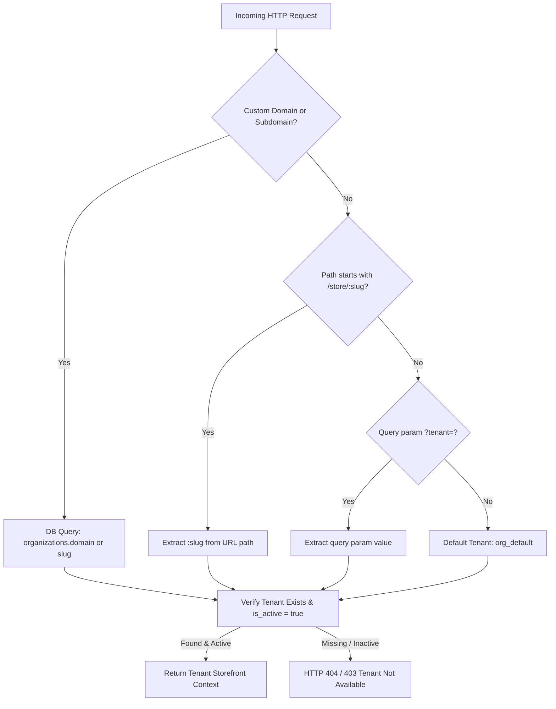

# Architecture Specification: Multi-Tenant Modern Storefront (UX-001A)

> **Document Version**: 1.0.0  
> **Status**: READY FOR SUPERVISOR REVIEW  
> **Parent Program**: `VERSION-2.6-UPGRADE` (`2.6.0-development`)  
> **Branch**: `upgrade/v2.6/upg-001-platform-hardening`  
> **Target Standard**: WCAG 2.2 AA Compliance & Server-Authoritative Multi-Tenant Commerce Architecture  

---

## 1. Executive Summary

This architecture specification defines the transition of the AbaCha storefront from a client-centric prototype into an enterprise-grade, server-authoritative, responsive, accessible, and multi-tenant commerce storefront.

The current implementation relies on a monolithic browser context ([CommerceContext.tsx](file:///c:/Users/SAHR/OneDrive%20-%20DreamDay%20Technology/Documents/GitHub/POS-E-Commerce/src/context/CommerceContext.tsx)), loads entire catalogs into client memory and `localStorage`, executes client-side filtering and price math, lacks URL-based routing, hardcodes commercial promises (such as "$75 free shipping" and warranty terms), and forces all unauthenticated public traffic into a single default tenant (`org_default`).

This document provides:
1. A forensic baseline audit tracing existing data flows.
2. A server-authoritative tenant resolution and storefront context contract.
3. Database and API architectures for tenant-scoped catalogs and commerce operations.
4. A URL-based routing architecture preserving deep-linking and browser history.
5. High-performance, accessible, and responsive component architectures meeting WCAG 2.2 AA standards.
6. Data ownership, security boundaries, migration phases, and rollback mechanisms.

---

## 2. Phase 1 — Current Storefront Baseline Audit & Data Flow Tracing

### 2.1 Component & Service Baseline Inspection

| File / Component | Primary Responsibility | Architectural Flaws & Authority Leaks |
| :--- | :--- | :--- |
| [Storefront.tsx](file:///c:/Users/SAHR/OneDrive%20-%20DreamDay%20Technology/Documents/GitHub/POS-E-Commerce/src/components/storefront/Storefront.tsx) | Root storefront coordinator | Single-state navigation (`activeSection: 'home' \| 'catalog'`); loads entire `products` array from `CommerceContext`; performs in-memory JS filtering, search, sorting, and pagination; hardcodes category array (`['All', 'Electronics', ...]`); derives brands via `Set(products.map(p => p.brand))`. |
| [StoreHeader.tsx](file:///c:/Users/SAHR/OneDrive%20-%20DreamDay%20Technology/Documents/GitHub/POS-E-Commerce/src/components/storefront/StoreHeader.tsx) | Storefront header & search | Hardcodes top announcement bar claims ("Free shipping over $75", "2-Year Official Warranty", "WELCOME20 / GUEST5"); hardcoded super admin link; derives category dropdowns from in-memory product list. |
| [StoreHeroBanner.tsx](file:///c:/Users/SAHR/OneDrive%20-%20DreamDay%20Technology/Documents/GitHub/POS-E-Commerce/src/components/storefront/StoreHeroBanner.tsx) | Promotional hero carousel | Hardcodes static `PROMO_SLIDES` (Ethiopian Yirgacheffe coffee, titanium smartwatches, etc.) regardless of tenant; mock countdown timer ticks down artificially in browser state. |
| [ProductCard.tsx](file:///c:/Users/SAHR/OneDrive%20-%20DreamDay%20Technology/Documents/GitHub/POS-E-Commerce/src/components/storefront/ProductCard.tsx) | Product grid card | Computes stock availability via client helper `getTotalStockForVariant(p.variants[0])` against `localStorage`; formats variant retail price directly without server validation; clicking triggers `onSelectProduct(product)` setting React modal state instead of navigating to a URL. |
| [ProductDetailModal.tsx](file:///c:/Users/SAHR/OneDrive%20-%20DreamDay%20Technology/Documents/GitHub/POS-E-Commerce/src/components/storefront/ProductDetailModal.tsx) | Monolithic product detail view (1,311 lines) | Modal-only display with zero deep-linking or URL slug; reads stock and locations from client memory; calculates estimated delivery using client math; review creation (`addProductReview`) appends to client memory and `localStorage`. |
| [ProductCarouselSection.tsx](file:///c:/Users/SAHR/OneDrive%20-%20DreamDay%20Technology/Documents/GitHub/POS-E-Commerce/src/components/storefront/ProductCarouselSection.tsx) | Horizontal product slider | Receives in-memory filtered products from parent; renders `ProductCard` without pagination or lazy data fetching. |
| [CategoryShowcase.tsx](file:///c:/Users/SAHR/OneDrive%20-%20DreamDay%20Technology/Documents/GitHub/POS-E-Commerce/src/components/storefront/CategoryShowcase.tsx) | Category display grid | Hardcodes `CATEGORIES_METADATA` with static Unsplash images, icons, and tags; completely disconnected from tenant category database. |
| [BrandShowcase.tsx](file:///c:/Users/SAHR/OneDrive%20-%20DreamDay%20Technology/Documents/GitHub/POS-E-Commerce/src/components/storefront/BrandShowcase.tsx) | Brand showcase slider | Hardcodes `BRANDS_METADATA` with static descriptions and logos (Munich, Tokyo, Kyoto, etc.); completely disconnected from tenant brand database. |
| [StoreCartDrawer.tsx](file:///c:/Users/SAHR/OneDrive%20-%20DreamDay%20Technology/Documents/GitHub/POS-E-Commerce/src/components/storefront/StoreCartDrawer.tsx) | Slide-over cart drawer | Hardcodes `const freeShippingThreshold = 75;`; computes subtotals, item counts, and coupon discounts purely in browser JavaScript; writes cart mutations to `localStorage`. |
| [StoreCheckoutModal.tsx](file:///c:/Users/SAHR/OneDrive%20-%20DreamDay%20Technology/Documents/GitHub/POS-E-Commerce/src/components/storefront/StoreCheckoutModal.tsx) | Checkout modal (1,172 lines) | Client-side form modal; submits checkout via `placeEcommerceOrder()` which calls `POST /api/orders` but relies on pre-authenticated `authClient` JWT; lacks anonymous guest checkout flow; requires modal state. |
| [CustomerAccountModal.tsx](file:///c:/Users/SAHR/OneDrive%20-%20DreamDay%20Technology/Documents/GitHub/POS-E-Commerce/src/components/storefront/CustomerAccountModal.tsx) | Customer account & order tracking (1,433 lines) | Monolithic modal managing profiles, address books, order tracking, and wishlist in client state; order list filtered from `orders` array stored in browser `localStorage`. |
| [MobileFilterDrawer.tsx](file:///c:/Users/SAHR/OneDrive%20-%20DreamDay%20Technology/Documents/GitHub/POS-E-Commerce/src/components/storefront/MobileFilterDrawer.tsx) | Mobile facet filter drawer | Operates entirely on client arrays passed down from `Storefront.tsx`; cannot trigger server-side facet aggregations. |
| [MobileBottomNav.tsx](file:///c:/Users/SAHR/OneDrive%20-%20DreamDay%20Technology/Documents/GitHub/POS-E-Commerce/src/components/storefront/MobileBottomNav.tsx) | Mobile bottom navigation bar | Toggles local state callbacks (`setActiveSection('home')`, `setActiveSection('catalog')`); no browser URL synchronization. |
| [CommerceContext.tsx](file:///c:/Users/SAHR/OneDrive%20-%20DreamDay%20Technology/Documents/GitHub/POS-E-Commerce/src/context/CommerceContext.tsx) | Monolithic global context (2,802 lines) | Manages products, categories, brands, customers, orders, inventory, shift, bins, ledger, coupons in a single state tree; syncs all state directly to `localStorage` under non-tenant-scoped keys (`abacha_commerce_db_v1_*`); causes root-level re-render waterfalls. |
| [authClient.ts](file:///c:/Users/SAHR/OneDrive%20-%20DreamDay%20Technology/Documents/GitHub/POS-E-Commerce/src/services/authClient.ts) | Frontend authentication helper | Hardcodes default tenant `organizationId = 'org_default'`; auto-logs into `viewer@abacha.internal` for storefront; provides no multi-tenant public session handling. |
| [server.ts](file:///c:/Users/SAHR/OneDrive%20-%20DreamDay%20Technology/Documents/GitHub/POS-E-Commerce/server.ts) | Backend Express server | `/api/products` hardcodes fallback `(p.organizationId || 'org_default') === 'org_default'` for unauthenticated callers; lacks public storefront context endpoint; in-memory `masterProductsStore` used for product GETs. |

---

### 2.2 Forensic End-to-End Data Flow Trace

The diagram below traces the current data flow from unauthenticated storefront visit through to order completion, illustrating where tenant identity is missing, implicit, or client-authoritative:

```text
[1. User Enters Storefront]
       │
       ▼
   Browser loads App.tsx / Storefront.tsx
       │
       ├── Tenant Identification: MISSING
       │   No hostname inspection, no path slug, no query parameter parsing.
       │
       ▼
[2. Storefront State Initialization]
       │
       ├── CommerceContext reads window.localStorage ('abacha_commerce_db_v1_products')
       │   Authority Leak: CLIENT-AUTHORITATIVE
       │   Catalog data is read from unauthenticated browser storage.
       │
       ▼
[3. Product Request to Backend (if triggered)]
       │
       ├── GET /api/products
       │   Tenant Header: None (Unauthenticated)
       │   Backend Resolution (server.ts lines 625-627):
       │   result.filter(p => (p.organizationId || 'org_default') === 'org_default')
       │   Authority Leak: HARDCODED TO 'org_default'
       │   Impossible for public shopper to view Tenant B's store!
       │
       ▼
[4. Catalog Browsing & Filtering]
       │
       ├── Storefront.tsx executes client-side Array.prototype.filter()
       │   Hardcoded categories: ['Electronics', 'Home & Kitchen', ...]
       │   Hardcoded brands: Array.from(new Set(products.map(p => p.brand)))
       │   Authority Leak: CLIENT MEMORY COMPUTATION
       │
       ▼
[5. Pricing & Stock Availability Check]
       │
       ├── ProductCard / ProductDetailModal reads:
       │   price = variant.retailPrice
       │   available = getTotalStockForVariant(variant)
       │   Authority Leak: CLIENT MEMORY & HARDCODED CLAIMS
       │   Stock is summed from client localStorage balances.
       │   Claims ("Free shipping over $75", "2-Year Warranty") are hardcoded strings.
       │
       ▼
[6. Cart Operations]
       │
       ├── StoreCartDrawer mutates storeCart in React state & localStorage
       │   Authority Leak: UNVALIDATED CLIENT STATE
       │   Prices and coupon discounts are calculated in browser JavaScript.
       │
       ▼
[7. Order Submission (Checkout)]
       │
       ├── StoreCheckoutModal invokes placeEcommerceOrder()
       │   authClient.getAuthHeaders() attaches JWT for 'viewer@abacha.internal' (org_default)
       │   POST /api/orders
       │   resolveAuthorizedTenant(req) checks JWT -> locks to org_default
       │   orderService.placeStorefrontOrder validates stock in DB & commits order
       │   Authority Status: BACKEND IS AUTHORITATIVE FOR FINAL COMMIT,
       │   BUT PRE-CHECKOUT EXPERIENCE IS COMPLETELY CLIENT-AUTHORITATIVE AND LOCKED TO ONE TENANT!
```

---

## 3. Phase 2 — Tenant-Aware Storefront Architecture & Contract

### 3.1 Tenant Resolution Hierarchy

To support multi-tenancy without disrupting the existing backend isolation contract, tenant resolution for public storefronts will adhere to this priority order:

1. **Custom Hostname / Subdomain Mapping**:
   - `tenant-alpha.abacha.com` → resolves to tenant slug `tenant-alpha`.
   - `store.customdomain.com` → resolves via tenant domain lookup in database.
2. **Explicit Storefront Path Slug**:
   - `/store/:tenantSlug/...` → e.g. `/store/alpha/shop` resolves to tenant slug `alpha`.
3. **Storefront Query Parameter (Development & Sandbox Mode)**:
   - `?tenant=:tenantSlug` or `?store=:storeSlug`.
4. **Platform Default Tenant Fallback**:
   - `/` or `/shop` (without subdomain or slug) resolves to canonical default tenant (`org_default`).



---

### 3.2 Database Schema Extension: Migration `011_storefront_tenant_config.sql`

To eliminate hardcoded commercial claims and isolate branding, currency, and policies, the `organizations` table is augmented with structured JSONB configuration:

```sql
-- Migration 011: Storefront Multi-Tenant Configuration & Domain Binding
ALTER TABLE organizations
  ADD COLUMN IF NOT EXISTS slug VARCHAR(64) UNIQUE,
  ADD COLUMN IF NOT EXISTS custom_domain VARCHAR(255) UNIQUE,
  ADD COLUMN IF NOT EXISTS currency_code VARCHAR(16) NOT NULL DEFAULT 'USD',
  ADD COLUMN IF NOT EXISTS currency_symbol VARCHAR(8) NOT NULL DEFAULT '$',
  ADD COLUMN IF NOT EXISTS locale VARCHAR(16) NOT NULL DEFAULT 'en-US',
  ADD COLUMN IF NOT EXISTS timezone VARCHAR(64) NOT NULL DEFAULT 'UTC',
  ADD COLUMN IF NOT EXISTS branding JSONB NOT NULL DEFAULT '{
    "storeName": "AbaCha Unified Commerce",
    "logoUrl": null,
    "faviconUrl": null,
    "primaryColor": "#4f46e5",
    "accentColor": "#f59e0b",
    "heroTitle": "Modern Unified Commerce",
    "heroSubtitle": "Engineered for speed, reliability, and precision inventory.",
    "trustBadges": [
      { "icon": "Truck", "title": "Free Delivery", "subtitle": "On qualifying orders" },
      { "icon": "ShieldCheck", "title": "Official Warranty", "subtitle": "Guaranteed quality" },
      { "icon": "RotateCcw", "title": "Hassle-Free Returns", "subtitle": "Customer first policy" }
    ]
  }'::jsonb,
  ADD COLUMN IF NOT EXISTS policies JSONB NOT NULL DEFAULT '{
    "freeShippingThreshold": 75.00,
    "standardShippingFee": 9.99,
    "expressShippingFee": 19.99,
    "shippingPolicy": "Standard shipping delivers within 3-5 business days.",
    "returnPolicy": "Returns accepted within 30 days of receipt in original condition.",
    "warrantyPolicy": "Standard 1-year manufacturer warranty applies to all electronics.",
    "deliveryPromise": "Orders placed before 2 PM dispatch same-day.",
    "pickupEnabled": true,
    "pickupInstructions": "Ready for pickup within 2 hours at your selected branch."
  }'::jsonb,
  ADD COLUMN IF NOT EXISTS catalog_policy JSONB NOT NULL DEFAULT '{
    "allowBackorders": false,
    "showInventoryCount": true,
    "lowStockThreshold": 5,
    "defaultSort": "featured"
  }'::jsonb,
  ADD COLUMN IF NOT EXISTS feature_flags JSONB NOT NULL DEFAULT '{
    "reviewsEnabled": true,
    "wishlistEnabled": true,
    "couponsEnabled": true,
    "pickupEnabled": true,
    "guestCheckoutEnabled": true,
    "orderTrackingEnabled": true
  }'::jsonb;

-- Seed default slug for initial organization
UPDATE organizations 
SET slug = 'default' 
WHERE id = 'org_default' AND (slug IS NULL OR slug = '');
```

---

### 3.3 Tenant Storefront Context API Contract

#### `GET /api/storefront/:tenantSlug/context`

Public, high-speed, cached endpoint delivering tenant configuration:

```typescript
// Conceptual Response DTO
export interface StorefrontContextResponse {
  success: true;
  data: {
    tenant: {
      id: string;
      code: string;
      slug: string;
      name: string;
    };
    branding: {
      storeName: string;
      logoUrl: string | null;
      primaryColor: string;
      accentColor: string;
      heroTitle: string;
      heroSubtitle: string;
      trustBadges: Array<{
        icon: string;
        title: string;
        subtitle: string;
      }>;
    };
    localization: {
      currencyCode: string;
      currencySymbol: string;
      locale: string;
      timezone: string;
    };
    policies: {
      freeShippingThreshold: number;
      standardShippingFee: number;
      expressShippingFee: number;
      shippingPolicy: string;
      returnPolicy: string;
      warrantyPolicy: string;
      deliveryPromise: string;
      pickupEnabled: boolean;
      pickupInstructions: string;
    };
    catalogPolicy: {
      allowBackorders: boolean;
      showInventoryCount: boolean;
      lowStockThreshold: number;
      defaultSort: string;
    };
    featureFlags: {
      reviewsEnabled: boolean;
      wishlistEnabled: boolean;
      couponsEnabled: boolean;
      pickupEnabled: boolean;
      guestCheckoutEnabled: boolean;
      orderTrackingEnabled: boolean;
    };
    pickupLocations: Array<{
      id: string;
      code: string;
      name: string;
      address: string;
      phone: string;
    }>;
  };
}
```

---

## 4. Phase 3 & 4 — Tenant-Scoped Catalog & Commerce Data Engine

### 4.1 Server-Authoritative Storefront Catalog Endpoints

All catalog browsing will be driven by server-side database queries through `CatalogRepository`, eliminating the loading of the full catalog into `localStorage`.

| Method & Route | Query Parameters | Description |
| :--- | :--- | :--- |
| `GET /api/storefront/:tenantSlug/products` | `category`, `brand`, `search`, `minPrice`, `maxPrice`, `inStock`, `onSale`, `sortBy`, `page`, `limit` | Paginated, tenant-scoped product search & faceted query. Does not return out-of-tenant records. |
| `GET /api/storefront/:tenantSlug/products/:slugOrId` | None | Detailed single-product view with variant matrix, real-time inventory balances, attributes, and approved reviews. |
| `GET /api/storefront/:tenantSlug/categories` | None | Returns active category hierarchy for this tenant only. |
| `GET /api/storefront/:tenantSlug/brands` | None | Returns active brands belonging to this tenant only. |
| `POST /api/storefront/:tenantSlug/cart/validate` | Body: `{ items: [{ variantId, quantity }] }` | Server-side cart validation returning live prices, verified line subtotals, current stock availability flags, and calculated shipping fees based on tenant policy. |

---

### 4.2 Server-Authoritative Availability & Pricing Rules

1. **Real-Time Stock Query**:
   Availability is calculated directly from `inventory_balances` table:
   $$\text{Available} = \max(0, \text{on\_hand} - \text{reserved} - \text{damaged} - \text{expired})$$
   Aggregated across tenant locations enabled for e-commerce fulfillment.
2. **Pricing Integrity**:
   - The browser never submits `price` to cart validation or checkout.
   - Price is looked up server-side from `product_variants.retail_price` matching the tenant's `organization_id`.
3. **Commercial Policy Engine**:
   - `freeShippingThreshold` is evaluated server-side.
   - If `cartSubtotal >= policies.freeShippingThreshold`, shipping fee is set to `0.00`.
   - Otherwise, `policies.standardShippingFee` is added.

---

## 5. Phase 5 — Professional Information Architecture & URL Routing

### 5.1 Route Mapping & Deep Linking Architecture

The application will transition from single-state modal toggling to a lightweight, URL-based router leveraging HTML5 History API (`window.history.pushState` and `window.addEventListener('popstate', ...)`), ensuring zero external dependency bloat while delivering complete deep-linking and browser navigation support:

```text
/store/:tenantSlug                       -> Homepage (Featured, categories, hero)
/store/:tenantSlug/shop                  -> Catalog / Shop with filters & sorting
/store/:tenantSlug/shop/category/:slug   -> Category filtered catalog
/store/:tenantSlug/shop/brand/:slug      -> Brand filtered catalog
/store/:tenantSlug/search?q=:query       -> Search results view
/store/:tenantSlug/product/:slugOrId     -> Full Product Detail Page (PDC)
/store/:tenantSlug/cart                  -> Dedicated Shopping Cart Page / View
/store/:tenantSlug/checkout              -> Multi-step Server-Authoritative Checkout
/store/:tenantSlug/account               -> Customer Account Portal
/store/:tenantSlug/account/orders        -> Customer Order History
/store/:tenantSlug/order/:orderNumber    -> Order Confirmation & Real-Time Tracking
```

*Note: In single-tenant or default-tenant mode, routes can seamlessly omit `/store/:tenantSlug` (e.g. `/shop`, `/product/:slug`) through the canonical tenant resolution fallback.*

---

## 6. Phase 6 & 7 — Modern Product Detail & Homepage Architecture

### 6.1 Product Detail Component Architecture (`src/components/storefront/product/`)

Instead of a monolithic 1,300-line modal, the product detail experience is structured into composable, single-responsibility modules:

```text
src/components/storefront/product/
├── ProductDetailPage.tsx          # Route container managing server fetch & state
├── ProductGallery.tsx             # Responsive image carousel with thumbnail strip & zoom
├── ProductInfo.tsx                # Title, brand link, SKU, rating summary, price display
├── VariantSelector.tsx            # Multi-attribute variant pills (Color, Size, Material)
├── StockAvailabilityBadge.tsx     # Real-time stock status (In Stock, Low Stock, Backorder)
├── BranchAvailabilityModal.tsx    # Multi-branch inventory lookup for in-store pickup
├── ShippingDeliveryEstimator.tsx  # Dynamic delivery countdown based on tenant cutoff time
├── ProductTabs.tsx                # Tabbed specifications, detailed description, policy tabs
├── ProductReviewsSection.tsx      # Verified customer reviews with submission modal
└── RelatedProductsCarousel.tsx    # Category/Brand recommendations slider
```

### 6.2 Homepage Component Architecture (`src/components/storefront/home/`)

```text
src/components/storefront/home/
├── StorefrontHomePage.tsx         # Homepage route view
├── StorefrontHero.tsx             # Tenant-branded hero with configurable CTA & trust points
├── CategoryGrid.tsx               # Dynamic tenant categories with visual accents
├── FeaturedCarousel.tsx           # Server-curated "Featured" & "New Arrivals" carousels
├── BestSellersSection.tsx         # Sales-count driven trending items
├── TenantPromotionsBar.tsx        # Tenant-configured seasonal promotional banners
├── TrustInformationBar.tsx        # Isolated trust badges (Warranty, Delivery, Support)
└── NewsletterSection.tsx          # Subscriber capture bound to customer repository
```

---

## 7. Phase 8 & 9 — Responsive & Accessibility Architecture (WCAG 2.2 AA)

### 7.1 Breakpoint Strategy

| Breakpoint | Target Devices | Layout Behavior |
| :--- | :--- | :--- |
| **Desktop (1440px+)** | 24"+ Monitors, Wide Displays | 4-column product grid, sticky facet sidebar, expanded top navigation, dual-pane detail gallery. |
| **Laptop (1024px–1439px)** | Laptops, Desktops | 3-column product grid, collapsible facet sidebar, compact header. |
| **Tablet (768px–1023px)** | iPads, Tablets in portrait/landscape | 2-column product grid, slide-over filter drawer, horizontal swipe carousels. |
| **Mobile (375px–767px)** | Smartphones | 1 or 2-column dense grid, bottom navigation bar (`MobileBottomNav`), full-screen filter bottom-sheet, sticky bottom "Add to Cart" action bar on product detail. |

### 7.2 WCAG 2.2 AA Accessibility Invariants

1. **Touch Targets**: All interactive elements (buttons, links, variant pills, quantity steppers, bottom nav tabs) must have a minimum bounding box of **$44 \times 44\text{ px}$**.
2. **Focus Management**:
   - Modals and drawers must implement accessible focus traps ([useModalFocusTrap.ts](file:///c:/Users/SAHR/OneDrive%20-%20DreamDay%20Technology/Documents/GitHub/POS-E-Commerce/src/hooks/useModalFocusTrap.ts)) with `Escape` key listeners.
   - Returning focus to the triggering element upon closure.
3. **Color Contrast**:
   - Text elements must meet a minimum contrast ratio of **4.5:1** for standard text and **3:1** for large headings in both Light and Dark modes.
4. **ARIA & Screen Readers**:
   - Search suggestion live regions with `aria-live="polite"`.
   - Clear accessible labels on all icon-only buttons (`aria-label="..."`).
   - Dynamic price and stock announcements.
5. **Reduced Motion**:
   - All animations honor CSS `@media (prefers-reduced-motion: reduce)`.

---

## 8. Phase 10 & 11 — Component Architecture & State Decoupling

### 8.1 State Modernization: Dedicated `StorefrontContext`

`CommerceContext.tsx` will no longer manage storefront catalog browsing. A dedicated, lightweight `StorefrontContext` will manage only active tenant context and client session data:

```typescript
export interface StorefrontState {
  tenantSlug: string;
  context: StorefrontContextData | null;
  isLoadingContext: boolean;
  error: string | null;
  cart: StorefrontCartItem[];
  wishlist: string[];
  activeCustomer: StorefrontCustomer | null;
}
```

- **Zero Catalog in LocalStorage**: Products are never persisted into `window.localStorage`.
- **Cart Session Storage**: Only minimal cart item tokens (`{ variantId, quantity }`) are cached in `localStorage` under tenant-scoped keys (e.g. `abacha_cart_${tenantSlug}`).
- **Independent Context**: Typing in search or filtering products does not trigger re-renders of admin, POS, or inventory back-office components.

---

## 9. Data Ownership, Security Boundaries & Authorization Matrix

```text
┌─────────────────────────────────────────────────────────────────────────────┐
│                          SECURITY & TENANT BOUNDARIES                       │
├────────────────────────────┬─────────────────────────┬──────────────────────┤
│ Operation                  │ Authority               │ Verification Gate    │
├────────────────────────────┼─────────────────────────┼──────────────────────┤
│ Tenant Context Query       │ Server (Public Cache)   │ Organization active  │
│ Catalog / Product Query    │ Server (CatalogRepo)    │ WHERE org_id = $1    │
│ Stock Availability Check   │ Server (InventoryRepo)  │ WHERE org_id = $1    │
│ Product Pricing            │ Server (CatalogRepo)    │ JOIN product_variants│
│ Cart Validation            │ Server (OrderService)   │ Real-time DB stock   │
│ Order Placement            │ Server (OrderService)   │ Atomic TX + Idemp.   │
│ Order Tracking             │ Server (OrderRepo)      │ Target tenant verify │
│ Customer Profile Read/Edit │ Server (Auth/Customer)  │ JWT + Org Boundary   │
└────────────────────────────┴─────────────────────────┴──────────────────────┘
```

1. **Strict Cross-Tenant Isolation**:
   - SQL queries executing on behalf of a storefront visitor must include `organization_id = $1`.
   - A visitor browsing Tenant Alpha cannot query, view, or purchase products belonging to Tenant Beta.
2. **Idempotent Order Creation**:
   - Every checkout submission dispatches a unique `idempotency_key`. Double-clicking or duplicate submissions safely return the existing order without duplicate charges or duplicate stock deductions.

---

## 10. Migration Sequence & Backward Compatibility

The storefront modernization is phased to preserve all existing functionality while introducing the new architecture incrementally:

1. **Step 1: Database Migration**: Run `011_storefront_tenant_config.sql` to equip `organizations` with storefront parameters.
2. **Step 2: Server API Endpoints**: Introduce `GET /api/storefront/:tenantSlug/context` and tenant-scoped catalog endpoints in `server.ts`.
3. **Step 3: Lightweight Storefront Router**: Integrate client URL routing in `App.tsx` and `StorefrontShell.tsx`.
4. **Step 4: Decomposed UI Components**: Replace monolithic modal views with dedicated route pages (`ProductDetailPage`, `StorefrontHomePage`, `StorefrontCatalogPage`).
5. **Step 5: Server-Authoritative Cart & Checkout**: Wire cart validation and order placement directly to the new endpoints.
6. **Step 6: Accessibility & Performance Validation**: Verify WCAG 2.2 AA compliance and verify full regression test suite.

---

## 11. Rollback Considerations

- **Database Non-Destructive**: Migration 011 adds optional columns with sensible defaults (`DEFAULT 'USD'`, `DEFAULT '{...}'::jsonb`), requiring no table drops or breaking schema changes.
- **Dual API Compatibility**: Existing `/api/products` and `/api/orders` endpoints remain intact for back-office and POS terminal workflows.
- **Frontend Fallback**: If a tenant slug is unresolvable, the storefront gracefully falls back to the default tenant (`org_default`), ensuring uninterrupted customer service.
